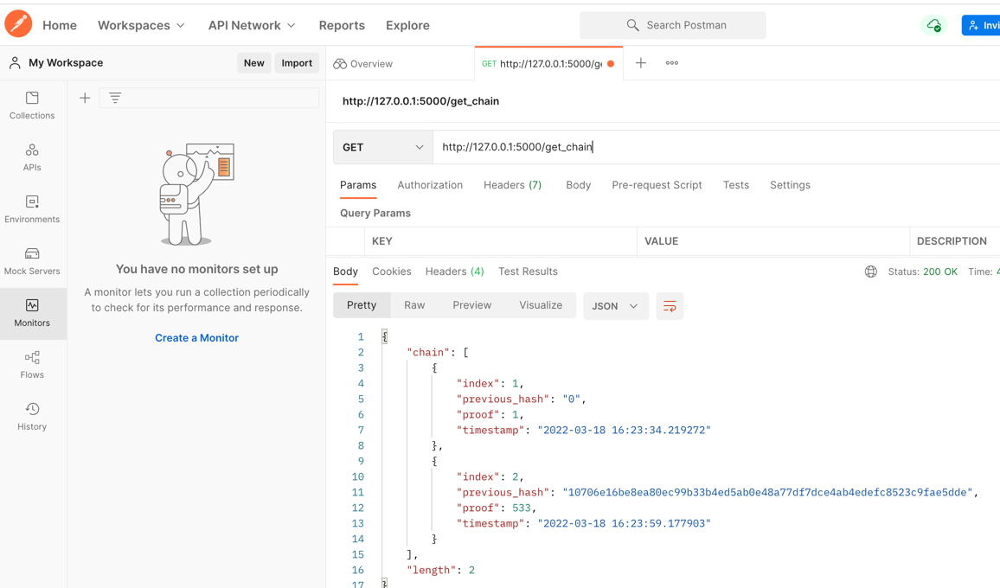
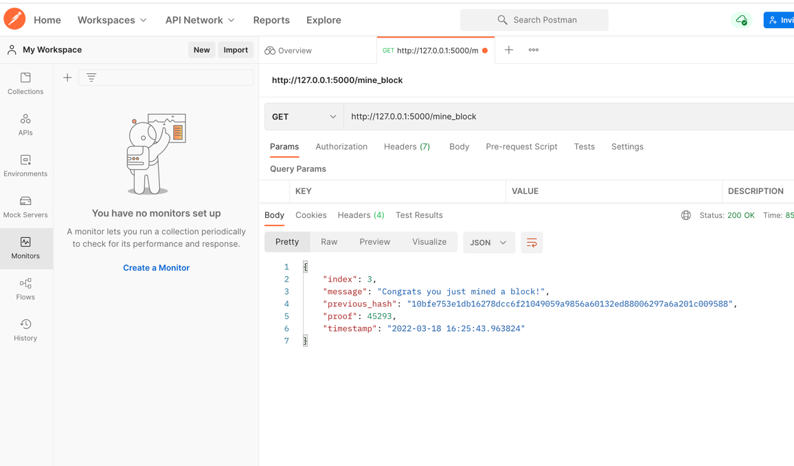
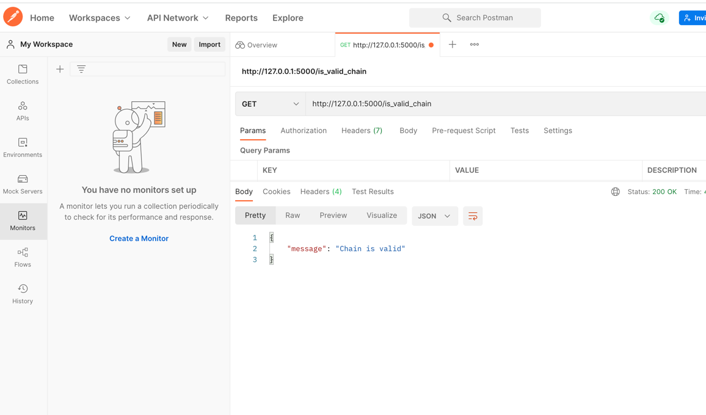

# Code as part of Udemy course "Blockchain A-Z™: Learn How To Build Your First Blockchain"

URL: https://www.udemy.com/course/build-your-blockchain-az/

Run Blockchain:
- Install https://www.postman.com/downloads/ 
- Run Postman (including login)
- Run create_blockchain.py
- Show chain

- Add new block

- Check if chain is valid
- 